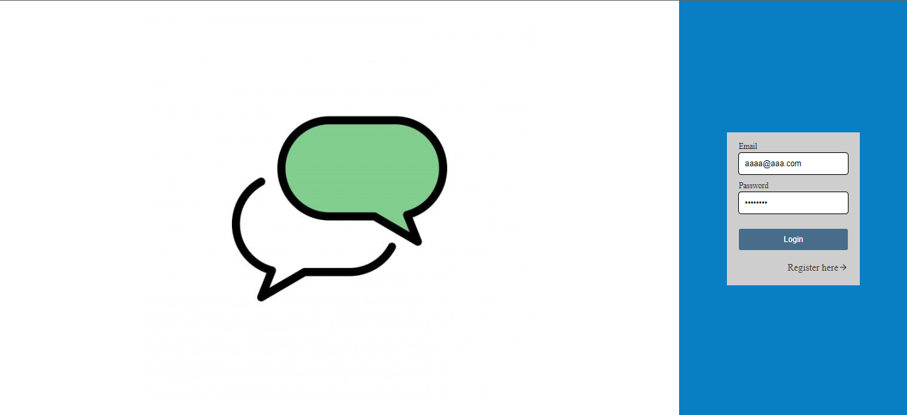

# Node Chat

  
  
  

Este projeto esta sendo desenvolvido para ser um chat em tempo real utilizando Node.js para o servidor React.js para o cliente e a biblioteca Socket.IO para fazer a comunicação entre os dois por meio de web sockets.

## Sumario

 - [Config](#config)
   - [server](#server)
   - [client](#client)
 - [Links Uteis](#links-uteis)
 - [Demonstração](#demonstração)
   - [Desktop](#desktop)
   - [mobile](#mobile)
 - [Client](#client-1)
   - [Comandos utilizados](#comandos-utilizados)
 - [Server](#server-1)
   - [Comandos utilizados](#comandos-utilizados-1)

## Config

### server

Fill the `.env` file based on `.env.example`

Run `npm install` to install the project dependencies

Run `npm run migrate` to create the database tables

Run `npm run dev` to start development server

### client

Fill the `.env` file based on `.env.example`

Run `npm install` to install the project dependencies

Run `npm start` to start development server

## Links uteis:

 - [React Router DOM](https://reactrouter.com/)
  
 - [Socket.io](https://socket.io/)

 - [React Icons](https://react-icons.github.io/react-icons/)

 - [Prisma](https://www.prisma.io/docs/reference)

 - [Express](https://expressjs.com/)
  
 - [Cors](https://expressjs.com/en/resources/middleware/cors.html)

 - [Bcrypt](https://www.npmjs.com/package/bcrypt)
  
 - [JsonWebToken](https://www.npmjs.com/package/jsonwebtoken)

 - [Dotenv](https://www.npmjs.com/package/dotenv)

## Demonstração

#### Link: 

### Desktop

    
    

### Mobile

  
  
  

 

## client

Front-end do projeto desenvolvido utilizando a biblioteca `React`, Utilizando o `React Router Dom` para a criação de rotas da aplicação e o `Socket.IO client` para realizar a comunicação com o servidor por meio de WebSockets

### comandos utilizados

 - `npx create-react-app client`

 - `npm install react-router-dom@6`

 - `npm install socket.io-client`

 - `npm install react-icons`

## server

Back-end do projeto desenvolvido com `Node.js`, Utilizando `Express` para fazer um controle de requisições http e o `Socket.IO` para fazer a comunicação de client e server por meio de WebSockets.

### comandos utilizados

 - `npm init`

 - `npm install express`

 - `npm install nodemon`

 - `npm install socket.io`

 - `npm install cors`

 - `npm install dotenv`

 - `npm install bcrypt`

 - `npm install jsonwebtoken`

 - `npm install prisma --save-dev`

 

---

Desenvolvido Por [Alessandro Massarotti Jr](https://github.com/alessandro-massarotti-jr) 🤖
